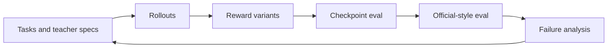

## CritPT-RL

**Status:** public repository; local tests and analysis are reproducible, while remote training depends on private infrastructure.

**One-line positioning:** a post-training and evaluation lab for Qwen-style models on scientific Python-answer tasks, where the model must return an executable Python `answer()` function.

### Why

I wanted a small but inspectable post-training loop: one task format, several reward variants, checkpoint evaluation, and enough logging to see whether the model learned the target skill or only learned the surface format.

### What I Built

- A GRPO post-training workflow around verl, vLLM rollouts, checkpoint merge/eval scripts, and metric visualization.
- Data paths for synthetic tasks, official-style prompt wrappers, failure-mined hard cases, and LLM-generated teacher specifications.
- Reward variants including local verification, semantic code judging, length-aware shaping, strict final-answer judging, and LLM-as-a-judge wrappers.
- Evaluation-analysis scripts to compare local/synthetic rewards against official-style evaluation.

### Hard Parts

- Keeping reward signals aligned with the benchmark target instead of rewarding easy-to-check formatting.
- Diagnosing why later runs produced cleaner `answer()` structure without improving official70 accuracy.

### Evidence

- [GitHub repository](https://github.com/jywang001/CritPT-RL)
- Repository docs cover scope, result summaries, repository map, reproduction notes, and safety limits.
- The most useful finding is negative: formatting and executable structure are necessary, but not sufficient for benchmark transfer.

### Result / Lesson

The pipeline runs, but the main lesson is not "RL solved the task." The sharper lesson is that reward design must match the semantic target of the official evaluation; otherwise training can improve format, style, and answer shape without moving the benchmark score.

## CritPT-RL

**状态：**公开仓库；本地测试和分析可复现，远端训练依赖私有算力/环境。

**一句话定位：**面向 scientific Python-answer 任务的 Qwen-style 模型后训练与评测实验，模型需要输出可执行的 Python `answer()` 函数。

### Why

我想做一个小而可检查的后训练闭环：任务形式固定，reward 变体清楚，有 checkpoint evaluation，也有足够日志判断模型到底学到了目标能力，还是只学会了表面格式。

### What I Built

- 基于 verl、vLLM rollout、checkpoint merge/eval 脚本和指标可视化的 GRPO 后训练流程。
- synthetic tasks、official-style prompt wrappers、failure-mined hard cases、LLM-generated teacher specifications 等数据路径。
- local verification、semantic code judging、length-aware shaping、strict final-answer judging、LLM-as-a-judge wrappers 等 reward 变体。
- 用于比较 local/synthetic reward 和 official-style evaluation 的自动化分析脚本。

### Hard Parts

- 让 reward 信号对齐目标 benchmark，而不是奖励容易检查的格式。
- 诊断为什么后期 runs 让 `answer()` 结构更干净，却没有提升 official70 accuracy。

### Evidence

- [GitHub 仓库](https://github.com/jywang001/CritPT-RL)
- 仓库文档包含 scope、result summary、repository map、复现说明和安全边界。
- 最有价值的结论是一个负结果：格式和可执行结构是必要条件，但不足以保证 benchmark transfer。

### Result / Lesson

这个 pipeline 已经跑通，但重点不是“RL 成功解决任务”。更关键的教训是：reward 设计必须和 official evaluation 的语义目标一致；否则训练可能让格式、风格和 answer 结构变好，但 benchmark 分数不动。

