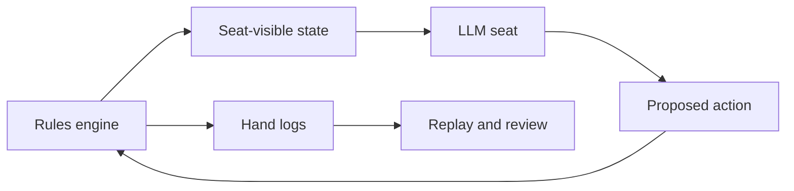

## Texas-Poker-Agents

**Status:** public repository; imported from local development and still evolving.

**One-line positioning:** a local no-limit Texas Hold'em table for studying how LLM agents act under imperfect information and strict visibility constraints.

### Why

Poker is useful because it punishes hidden-state leakage. An LLM seat should not see private cards, future community cards, or host-only debug information. That makes the project a practical testbed for prompts, action constraints, logs, and post-hand review.

### What I Built

- A browser table where one human can play against multiple LLM seats.
- A Node.js rules engine that owns shuffling, dealing, legal actions, side pots, all-in settlement, showdown, and match flow.
- Per-seat model/style configuration, table talk, fallback decisions, and persistent hand histories.
- Host-only god view for card inspection, reasoning summaries, and post-hand review.
- Engine tests for hand evaluation, side pots, run-it-multiple-times settlement, blinds, fallback behavior, and table-talk filtering.

### Hard Parts

- Keeping each LLM prompt limited to the seat's visible state while still allowing useful reasoning and table talk.
- Making failures inspectable: when a model returns an illegal or malformed action, the system needs fallback behavior and a log trail rather than silent breakage.

### Evidence

- [GitHub repository](https://github.com/jywang001/Texas-Poker-Agents)
- README documents local setup, engine behavior, agent prompts, logs, and test coverage.
- The design separates the authoritative rules engine from model decisions, so the model proposes actions but cannot mutate hidden game state.

### Result / Lesson

The project is less about building a poker bot and more about building a controlled agent environment. The strongest lesson is that imperfect-information agents need explicit information boundaries, legality checks, and durable logs before their behavior can be trusted or studied.

## Texas-Poker-Agents

**状态：**公开仓库；从本地开发导入，仍在迭代。

**一句话定位：**一个本地无限注德州扑克桌，用来观察 LLM agent 在不完美信息和严格可见性约束下如何行动。

### Why

德州扑克适合做这个实验，因为它天然惩罚隐藏信息泄露。LLM 座位不应该看到其他人的手牌、未来公共牌或房主调试信息。这个项目因此变成了 prompt、行动约束、日志和牌后复盘的测试台。

### What I Built

- 支持一名真人玩家对战多个 LLM 座位的浏览器牌桌。
- Node.js 规则引擎负责洗牌、发牌、合法行动、边池、全下结算、摊牌和比赛流程。
- 每个 LLM 座位可配置模型和牌风，系统记录 table talk、fallback 决策和完整手牌历史。
- 房主专用 god view，用于查看暗牌、reasoning summary 和牌后复盘。
- 引擎测试覆盖牌型评估、边池、多次发牌、盲注、fallback 行为和 table-talk filtering。

### Hard Parts

- 让每个 LLM prompt 只包含该座位可见的信息，同时保留足够的推理和牌桌话空间。
- 让失败可检查：模型返回非法或格式错误行动时，系统需要 fallback 行为和日志，而不是静默崩掉。

### Evidence

- [GitHub 仓库](https://github.com/jywang001/Texas-Poker-Agents)
- README 记录了本地启动、规则引擎、agent prompt、日志和测试覆盖。
- 设计上把权威规则引擎和模型决策分开：模型只提出行动，不能修改隐藏牌局状态。

### Result / Lesson

这个项目的重点不是做一个 poker bot，而是搭一个受控 agent 环境。最大的教训是：不完美信息 agent 在被研究或信任之前，必须先有明确的信息边界、合法性检查和可持久化日志。

